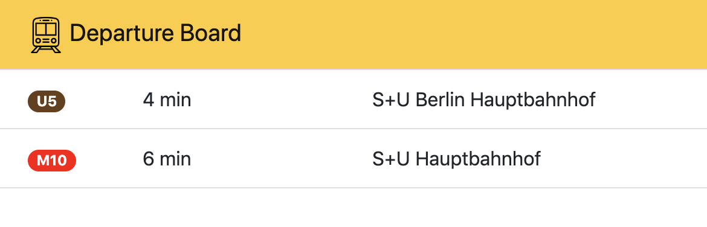

# Departure board
A minimalistic web-based departure board with an overview of upcoming scheduled departures from a station of choice in the Greater Berlin Area. This is a test project to acquaint myself with [Vue.js](https://vuejs.org/) and state-of-the-art Javascript best practices.



## Build Setup

``` bash
# install dependencies
npm install

# serve with hot reload at localhost:8080
npm run dev

# build for production with minification
npm run build
```

For detailed explanation on how things work, consult the [docs for vue-loader](http://vuejs.github.io/vue-loader).

# License
This project is licensed under [MIT license](LICENSE).

Icons were kindly made by Icons made by [Freepik](https://www.flaticon.com/authors/freepik) from [flaticon.com](https://www.flaticon.com).
